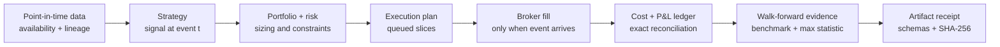

# microalpha

[](https://github.com/MateoBodon/microalpha/actions/workflows/ci.yml)
[](https://mateobodon.github.io/microalpha/)
[](pyproject.toml)
[](LICENSE)

**A quant research audit lab that catches four ways a backtest lies: data
leakage, impossible execution, omitted costs, and selection overfitting.**

Microalpha is an event-driven Python system for turning a quantitative idea
into timestamped, costed, walk-forward evidence. Its flagship is not a profitable
strategy. It is a deterministic, known-ground-truth fixture that proves the
research pipeline rejects attractive results when they are invalid.


## The 30-second proof

```bash
git clone https://github.com/MateoBodon/microalpha.git
cd microalpha
python -m venv .venv && source .venv/bin/activate
python -m pip install .
microalpha audit-demo
```

The command uses no network, provider, licensed data, or hidden holdout. It
recreates the tracked evidence under `docs/assets/audit_lab/`.

| Failure injected into the synthetic fixture | Naive result | Audited result | What stopped it |
| --- | ---: | ---: | --- |
| Revised value used before availability | Sharpe `+20.53` | `−0.17` | 756 unavailable rows blocked |
| Same-tick signal and fill | Sharpe `+21.89` | `+0.17` | Fill queued until the t+1 market event |
| Costs omitted from a planted control | Sharpe `+0.57` | `−0.68` | Commission, spread, impact, and borrow reconciled |
| Best of 128 noise models | Sharpe `+1.38` | OOS `−1.28` | Walk-forward split; max-stat `p=0.601` |

The separately labeled planted positive control passes at `p=0.001`, showing
that the correction is capable of detecting a known effect rather than merely
rejecting everything. These values are software-test outputs, not market
performance or evidence of alpha.

Canonical receipt SHA-256:
`6e36c2397696d7e9eecbd058cbfc1ba522c8ffba7e5798224de86b20457b6575`.
The [receipt](docs/assets/audit_lab/receipt.json) binds the input fixture,
generator version and source, and every JSON, CSV, and SVG artifact by hash.

On the current Apple arm64 benchmark host, Audit Lab completed in a median
`1.3745 s` across five runs and the no-op event loop processed `1,464,231`
events/s. These are host-dependent engineering baselines, documented in the
[benchmark receipt](docs/assets/audit_lab/benchmark.json), not correctness or
performance promises.

## What is engineered, not asserted


- **Point-in-time discipline** — `require_point_in_time` fails closed on
  `available_at > decision_at` and reports exact violating row IDs and counts;
  production data manifests retain source lineage.
- **Event-time execution** — orders become planned execution slices; future
  fills cannot change cash, positions, turnover, P&L, or logs before their
  market event is processed.
- **Configurable execution costs** — commission, spread, slippage/impact,
  borrow, turnover, exposure, and capacity controls. These are simulation
  models, not claims of venue calibration.
- **Walk-forward evaluation** — parameter selection is isolated from test and
  holdout windows, with fold-level manifests and artifacts.
- **Selection control** — candidate-minus-benchmark returns are null-centered
  and synchronously resampled for a max-statistic test that preserves
  cross-model dependence.
- **Artifact provenance** — generator source, version, seed, schema, inputs,
  and canonical outputs are hash-bound. The Audit Lab excludes clocks, hosts,
  and absolute paths, so clean directories reproduce identical bytes.

Audit Lab uses transparent NumPy oracle constructions so each injected failure
has known ground truth. Production event scheduling is exercised separately by
the [future-fill regression test](tests/test_tplus1_execution.py); the shared
max-statistic implementation is covered by
[selection-control tests](tests/test_multiple_testing.py).

## Architecture



Data access, signal formation, portfolio construction, execution, inference,
and claim gating remain separate so each timing assumption has a testable
boundary. See the [architecture guide](docs/architecture.md) and
[Audit Lab methodology](docs/audit-lab.md).

## CLI and Python API

| Command | Purpose |
| --- | --- |
| `microalpha audit-demo` | Rebuild the deterministic correctness fixture and receipt |
| `microalpha --version` | Print the installed distribution version |
| `microalpha run --config <yaml> --out <dir>` | Run one event-driven simulation |
| `microalpha wfv --config <yaml> --out <dir>` | Run walk-forward selection and evaluation |
| `microalpha report --artifact-dir <run>` | Render a report from an existing artifact set |
| `microalpha info` | Print environment and package metadata as JSON |

The same demo is available as a Python API:

```python
from microalpha.audit_lab import run_audit_lab

result = run_audit_lab("my-audit-evidence")
print(result["receipt_sha256"])
```

Core extension points cover strategies, data handlers, portfolio policies,
execution models, slippage, reporting, and statistical controls. See the
[API guide](docs/api.md) and [examples](docs/examples.md).

## Reproduce and verify

```bash
# User-facing proof
microalpha audit-demo
git diff --exit-code -- docs/assets/audit_lab

# Contributor gates
python -m pip install -e '.[dev]'
ruff check .
black --check .
isort --check-only .
mypy --follow-imports=skip \
  src/microalpha/audit_lab.py src/microalpha/multiple_testing.py \
  src/microalpha/engine.py src/microalpha/execution.py \
  src/microalpha/reporting/factors.py
pytest -m "not wrds" --cov=microalpha --cov-report=term-missing
python scripts/check_data_policy.py
git ls-files -z README.md PROJECT.md pyproject.toml LICENSE CHANGELOG.md \
  Makefile 'src/**' 'tests/**' 'scripts/**' '.github/**' \
  docs/index.md docs/audit-lab.md docs/architecture.md docs/api.md \
  docs/examples.md docs/reproducibility.md docs/leakage-safety.md \
  docs/benchmarks.md docs/limitations.md docs/portfolio_evidence_2026-07-11.md \
  docs/wrds.md docs/flagship_momentum_wrds.md docs/results_wrds.md docs/factors.md \
  'docs/assets/audit_lab/**' \
  | xargs -0 detect-secrets-hook --baseline .secrets.baseline
mkdocs build --strict
```

CI runs the supported Python matrix and enforces lint, format, types, secret
scanning, tests, coverage, deterministic Audit Lab regeneration, and strict docs.

Two earlier synthetic example bundles remain available for schema and reporting
inspection: [`artifacts/sample_flagship`](artifacts/sample_flagship) and
[`artifacts/sample_wfv`](artifacts/sample_wfv). They are historical examples;
the Audit Lab above is the canonical product demonstration.

## Honest research case study

Microalpha was also used for a preregistered 2017–2022 licensed-data research
campaign. Six frozen mechanisms—including momentum, residual momentum, low
volatility, reversal, a fundamentals composite, and an SEC cash-earnings
candidate—each failed at least one promotion gate. The strongest development
candidate reached net HAC Sharpe `0.4736`, missed the `0.50` threshold, and
failed harsh costs at `−0.1034`. The 2023–2025 confirmation set remains sealed.

That is a feature of the project, not an embarrassing footnote: the system
preserved a negative result instead of retuning until a chart looked good. Read
the [public-safe case study](docs/portfolio_evidence_2026-07-11.md). Licensed
rows are not distributed.

## Repository map

| Path | Role |
| --- | --- |
| `src/microalpha/` | Engine, events, data, strategies, execution, portfolio, risk, inference, reporting |
| `tests/` | Chronology, execution, holdout, statistics, artifact, CLI, and data-policy contracts |
| `docs/assets/audit_lab/` | Generated public correctness evidence and SHA-256 receipt |
| `configs/` | Reproducible sample, public, and local licensed-data workflows |
| `docs/` | Product guides, methodology, API, limitations, and historical case study |
| `artifacts/` | Run-scoped simulation outputs; most generated paths remain untracked |

Historical project logs remain available for provenance, but a new user should
start with **Audit Lab → Architecture → API → Reproducibility → Limitations**.

## Limits and claim boundary

- Microalpha is research software, not a broker, execution venue, or live
  trading system.
- The Audit Lab is synthetic and deliberately adversarial. Its positive controls
  are not evidence of market predictability.
- Cost and impact models are configurable simulations; they are not calibrated
  to every asset, venue, or order type.
- Point-in-time safety ultimately depends on correct source availability
  metadata. A manifest cannot repair an incorrectly labeled dataset.
- Licensed-data research is reproducible only for authorized users with the
  exact source snapshot; raw WRDS/CRSP/OptionMetrics data is never published.
- No public package is published to PyPI because that distribution name belongs
  to an unrelated project. Install this repository from source or a GitHub
  release artifact.

More detail: [limitations](docs/limitations.md), [data policy](docs/wrds.md), and
[reproducibility](docs/reproducibility.md).

## License

Code is available under the [MIT License](LICENSE). Data sources and generated
research inputs may carry separate restrictions; the license does not grant
rights to third-party datasets.
