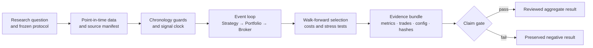
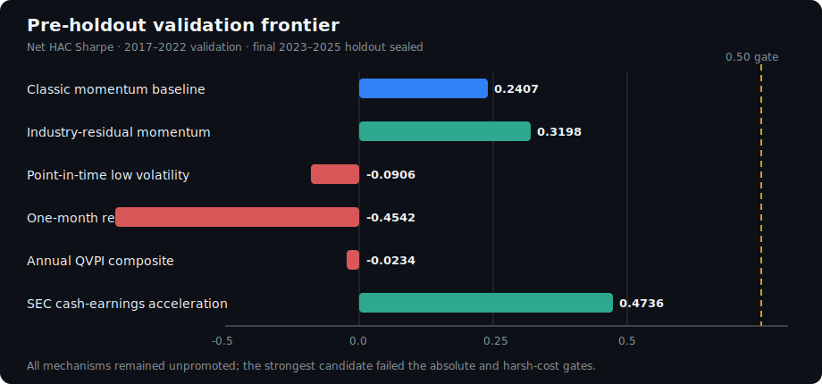

# microalpha

**A leakage-aware, event-driven research engine for turning quantitative ideas
into timestamped, costed, reproducible evidence.**

microalpha is built for the part of backtesting that is easiest to get wrong:
chronology, point-in-time data, execution timing, model selection, transaction
costs, and the boundary between an interesting validation result and a claim
that is actually ready to publish.

> **Status — research infrastructure, not a live trading system.** The public
> sample workflows validate the engine and reporting path. The latest reviewed
> licensed-data campaign remains pre-holdout: its 2023–2025 final holdout is
> sealed, and no alpha or live-performance claim is made.

| Completed evidence | Scope | Claim boundary |
| --- | --- | --- |
| Six frozen mechanisms | 2017–2022 validation | Every candidate was rejected by at least one preregistered gate |
| Immutable run manifests | Config, data identity, code state, outputs | Aggregate public receipts; licensed rows remain local |
| Final holdout | 2023–2025 | Sealed and not used in the reported economic evidence |

## What it makes auditable

| Research risk | microalpha control |
| --- | --- |
| Lookahead and same-period execution | Timestamp validation, explicit signal/fill clocks, tested `t+1` fills |
| Selection overfitting | Walk-forward folds, preregistered candidate sets, stationary-bootstrap reality checks |
| Frictionless backtests | Commission, slippage, borrow, turnover, capacity, and stress-cost accounting |
| Unreproducible results | Resolved configs, dataset/artifact manifests, run IDs, immutable metrics and trades |
| Licensed-data leakage | Raw WRDS/CRSP data stays local; only reviewed aggregate evidence is publishable |

## Quickstart

Requires Python 3.12+.

```bash
git clone https://github.com/MateoBodon/microalpha.git
cd microalpha
python -m venv .venv
source .venv/bin/activate
python -m pip install -e '.[dev]'

make sample
make report
```

The sample run writes a self-describing artifact directory containing the
resolved config, metrics, trades, exposures, equity curve, bootstrap result,
and manifest. Run the walk-forward path with:

```bash
make wfv
make report-wfv
```

These bundled inputs are for deterministic software validation—not evidence of
tradable performance.

## Research flow



The engine keeps data access, signal formation, portfolio construction, and
execution as separate steps so their timing assumptions can be tested directly.

## Evidence, including negative results

The latest completed economic ledger (as of **2026-07-11**) is intentionally
more useful than a single best backtest. Six frozen mechanisms were evaluated
on a 2017–2022 validation window while the 2023–2025 final holdout remained
sealed. Newer SEC 13F pipeline work is infrastructure progress, not newer
economic evidence.



| Frozen mechanism | Net HAC Sharpe | Decision |
| --- | ---: | --- |
| Classic momentum baseline | 0.2407 | Baseline; validation proxy only |
| Industry-residual momentum | 0.3198 | Rejected: improvement `0.0791` < required `0.10` |
| Low volatility | -0.0906 | Rejected on return and drawdown gates |
| One-month reversal | -0.4542 | Rejected; `63.27×` one-way turnover |
| Annual QVPI composite | -0.0234 | Rejected; restatement/vintage caveat remains |
| SEC cash-earnings acceleration | 0.4736 | Rejected: below `0.50`; harsh-cost Sharpe `-0.1034` |

This is **validation evidence, not a final-holdout or alpha claim**. The strongest
candidate was still rejected because the complete preregistered gate set did not
pass. Exact windows, costs, uncertainty, manifest digests, and caveats are in the
[public-safe research note](docs/portfolio_evidence_2026-07-11.md); chart values
are also available as [CSV](docs/assets/portfolio/validation_frontier.csv).

## Core capabilities

- **Event-driven engine** — explicit data, strategy, portfolio, risk, broker,
  and execution components with deterministic clocks.
- **Walk-forward validation** — training/test folds, parameter selection,
  per-fold outputs, and aggregate out-of-sample metrics.
- **Inference** — HAC statistics, Politis–White stationary bootstrap, reality
  checks, SPA tooling, and factor regressions.
- **Execution realism** — `t+1` fills, commissions, slippage/impact models,
  borrow costs, turnover controls, sector/industry caps, and capacity checks.
- **Evidence packaging** — resolved YAML, data IDs, manifests, metrics, trades,
  plots, and Markdown summaries designed to survive handoff and review.
- **Data boundaries** — deterministic synthetic samples, a small public-data
  path, and guarded adapters for local licensed research data.

## CLI

| Command | Purpose |
| --- | --- |
| `microalpha run --config <yaml> --out <dir>` | Run one event-driven backtest |
| `microalpha wfv --config <yaml> --out <dir>` | Run walk-forward validation |
| `microalpha report --artifact-dir <run>` | Render plots and a Markdown result summary |
| `microalpha info` | Print environment and package metadata as JSON |

Example public-data workflow:

```bash
microalpha wfv \
  --config configs/wfv_flagship_public.yaml \
  --out artifacts/public_wfv
microalpha report --artifact-dir artifacts/public_wfv/<RUN_ID>
```

The tiny public panel is a wiring/demo surface. Its latest audited run had zero
trades and must not be used as a performance claim.

## Output contract

A typical run includes:

```text
<RUN_ID>/
├── config_resolved.yaml
├── manifest.json
├── metrics.json
├── trades.jsonl
├── exposures.csv
├── equity_curve.csv
├── equity_curve.png
├── bootstrap.json
└── folds.json              # walk-forward runs
```

The manifest binds the run to its config, software state, and dataset identity;
reporting reads these artifacts rather than reconstructing results from prose.
Committed examples are available under
[`artifacts/sample_flagship`](artifacts/sample_flagship/) and
[`artifacts/sample_wfv`](artifacts/sample_wfv/).

## Licensed-data workflow

WRDS/CRSP exports are never committed. A local user can point the guarded config
at `WRDS_DATA_ROOT`, run the pipeline, and publish only reviewed aggregate
artifacts:

```bash
make wfv-wrds
make report-wrds
python reports/analytics.py artifacts/wrds_flagship/<RUN_ID>
python reports/spa.py --grid artifacts/wrds_flagship/<RUN_ID>/grid_returns.csv
```

See [the WRDS guide](docs/wrds.md) for schema, licensing, point-in-time, and
survivorship requirements.

## Repository map

| Path | Role |
| --- | --- |
| `src/microalpha/` | Engine, data, strategies, execution, portfolio, risk, reporting |
| `configs/` | Reproducible sample, public, and local licensed-data workflows |
| `tests/` | Chronology, execution, reporting, artifact, and data-policy contracts |
| `artifacts/` | Committed deterministic evidence used by docs and tests |
| `docs/` | User documentation, methods, data rules, and evidence notes |
| `reports/` | Analytics, factor, SPA, and summary entry points |

## Validation

```bash
ruff check
mypy src/microalpha/reporting/factors.py
pytest -q
mkdocs build --strict
```

Focused tests cover no-lookahead behavior, `t+1` execution, artifact schemas,
CLI contracts, factor alignment, data policy, and documentation links.

## Limitations

- microalpha does not connect to a broker or claim live execution.
- Public sample and mini-panel runs validate software behavior, not alpha.
- Licensed-data results are reproducible only for authorized users with the
  exact source snapshot; the repository publishes aggregates, not raw rows.
- The latest pre-holdout research candidates all failed at least one frozen
  promotion gate. The final 2023–2025 holdout remains sealed.
- Historical artifacts can become stale; trust a result only when its manifest,
  status label, and evidence note agree.

## Contributing and citation

Issues and focused pull requests are welcome. Preserve chronology, add a test
for any changed timing assumption, and bind result claims to generated artifacts.
For research use, cite the repository URL and the exact commit/artifact manifest
used in the analysis.

## License

No open-source license is currently declared for this repository. Data sources
may carry separate restrictions; WRDS/CRSP data are not redistributed here.
