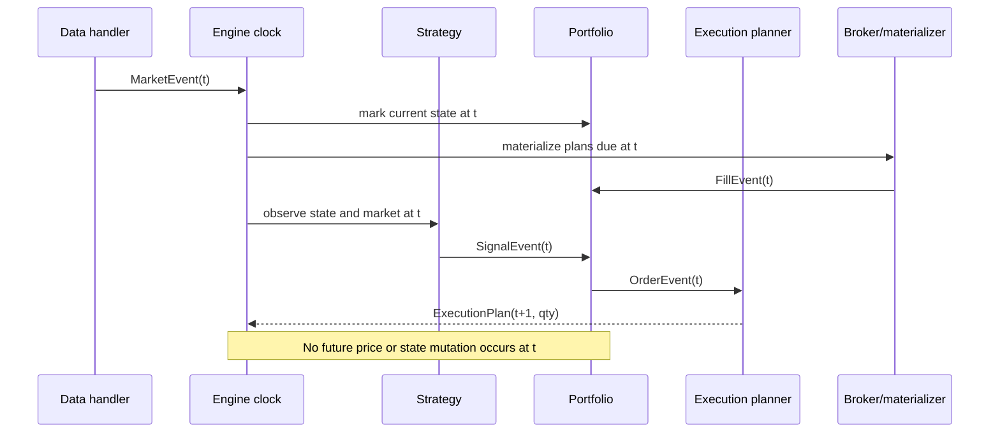

# Architecture

Microalpha is event-driven so timing assumptions remain explicit and testable.

## Event lifecycle

The built-in market-data executors plan timestamps and quantities without
reading future prices or volumes. When the matching symbol and timestamp arrive,
the broker materializes the slice using information available at that event.
TWAP and implementation-shortfall schedules are fixed ex ante. The safe VWAP
path uses equal ex-ante slices until an explicit historical volume profile is
provided; it never sizes from realized future volume.

Signals may specify `target_weight`, which the portfolio translates into the
delta between current and desired notional. Repeating the same target therefore
does not create a second full-size order; resizing, closing, and flipping remain
explicit. The legacy `weight` field retains its historical full-order sizing
behavior for compatibility.

## Component boundaries

| Component | Owns | Must not own |
| --- | --- | --- |
| Data handler | ordered observations and availability metadata | strategy selection |
| Strategy | signals at the current event | fills or future prices |
| Portfolio | sizing, cash, positions, exposure, turnover, risk | market-data revision logic |
| Execution planner | timestamps and slice quantities | future observed price/volume |
| Broker/materializer | fill at a due event | model selection |
| Walk-forward evaluator | train/test/holdout isolation | post-hoc strategy mutation |
| Evidence layer | schemas, hashes, reports, claim gate | reconstructing missing facts from prose |

## Statistical control

`centered_max_statistic_test` accepts an aligned candidate-return matrix and an
explicit benchmark series. It computes candidate-minus-benchmark statistics,
recenters all differentials under the null, and synchronously resamples rows.
This is the selection correction used by Audit Lab, the public Market Risk
Case, and walk-forward grid evaluation.

The older relative "best versus other candidates" SPA interpretation is not a
claim that any model beats a benchmark. Public claims use the explicit
benchmark-differential test.
