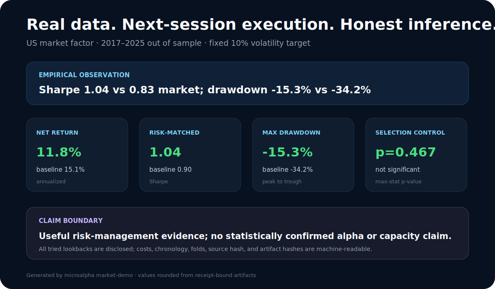
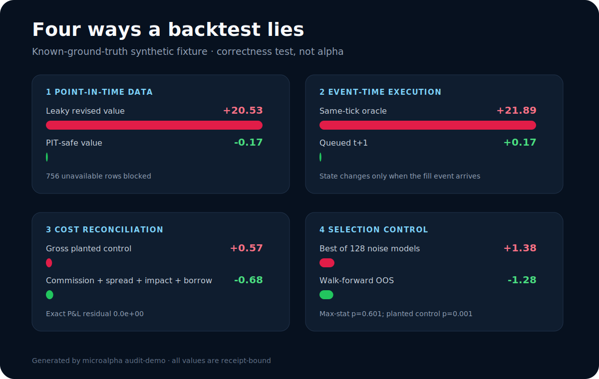

# Microalpha

**A quantitative engineering lab that turns market data into source-hashed,
chronology-safe, costed evidence—and makes invalid backtests visibly fail.**

## Real-data result



The fixed market volatility-targeting case is evaluated out of sample from
2017 through September 2025 with a one-session signal delay, target-position
rebalancing, an explicit commission/spread/impact ledger, annual folds, a
risk-matched baseline, block-bootstrap uncertainty, and max-statistic selection
control.

It reduced maximum drawdown from 34.2% to 15.3% and raised descriptive Sharpe
from 0.83 to 1.04, but its differential return was not statistically significant
after all four lookbacks were disclosed (`p=0.467`). Annualized return was
11.8%, below the market's 15.1%. This is useful risk-engineering evidence; the
investment claim is **none**.

```bash
git clone https://github.com/MateoBodon/microalpha.git
cd microalpha
python -m pip install .
python -m microalpha market-demo
python -m microalpha verify docs/assets/market_case
```

Install from this repository or a signed GitHub release; the namesake package on PyPI is an unrelated third-party project.

[Inspect the real-data method, daily ledger, folds, source manifest, and
receipt →](market-case.md)

## Correctness proof



Audit Lab injects data leakage, same-tick execution, omitted costs, and naive
model selection into a deterministic known-ground-truth fixture. The safe path
blocks or removes each failure, while a labeled positive control still passes.

```bash
python -m microalpha audit-demo
python -m microalpha verify docs/assets/audit_lab
```

All Audit Lab values are synthetic software-test outputs, never market or alpha
claims.

## Product path

1. [Market Risk Case](market-case.md) — real data, baselines, costs, folds,
   uncertainty, lineage, and honest inference.
2. [Audit Lab](audit-lab.md) — known-ground-truth correctness fixtures.
3. [Architecture](architecture.md) — event scheduling and component boundaries.
4. [API](api.md) — portable CLI and Python extension points.
5. [Reproducibility](reproducibility.md) — schemas, receipts, and clean-run gates.
6. [Limitations](limitations.md) — what the system does not prove.

The [licensed-data research case](portfolio_evidence_2026-07-11.md) documents a
separate negative discovery campaign: six mechanisms failed frozen promotion
gates while the 2023–2025 confirmation set remained sealed.
