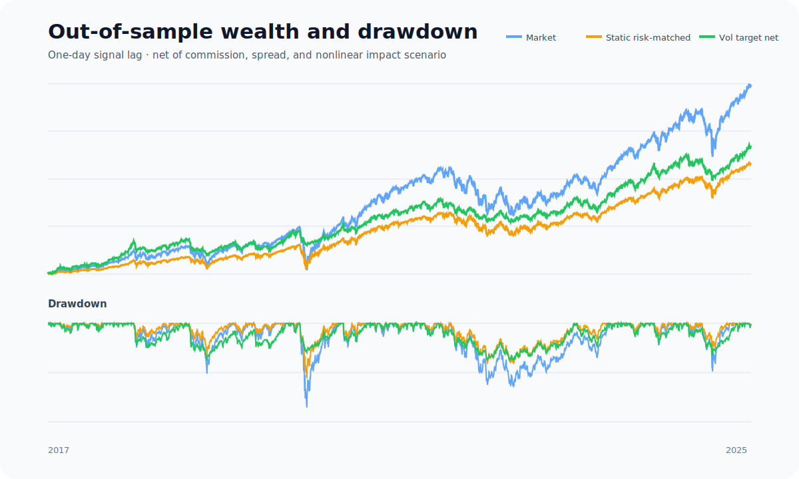
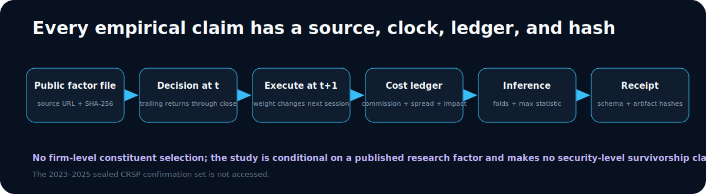

# Market Risk Case

**A fixed volatility-targeting rule is evaluated on real public factor data with
next-session execution, explicit costs, annual walk-forward folds, uncertainty,
and selection control.** The result is useful risk-engineering evidence, not a
claim of alpha.


## Result first

The specification is frozen at a 21-session volatility estimate, 10% annual
volatility target, and 1.5× maximum exposure. It is evaluated from 2017 through
September 2025 after a 2010–2016 calibration window.

| OOS metric | Vol target, net | US market | Static risk-matched |
| --- | ---: | ---: | ---: |
| Annualized return | 11.77% | 15.14% | 10.67% |
| Annualized volatility | 11.37% | 19.25% | 12.03% |
| Sharpe | 1.04 | 0.83 | 0.90 |
| Maximum drawdown | −15.31% | −34.22% | −22.38% |

The rule reduced realized risk and drawdown and improved descriptive Sharpe.
It did **not** produce a statistically significant differential return after
correcting across all four disclosed lookbacks: synchronous stationary
max-statistic `p=0.467`. Annualized return also remained below the unscaled
market. The investment claim is therefore **none**.



## The clock is part of the model

For session `t`, the volatility estimate includes returns only through the
close of `t`. The target is shifted by one full observation and becomes the
executed exposure on `t+1`. The tracked daily ledger records both
`signal_available_date` and execution `date`; the verifier rejects any row
where the first is not strictly earlier than the second.

The return identity is:

```text
gross(t) = RF(t) + executed_weight(t) × Mkt_RF(t)
net(t)   = gross(t) - commission(t) - half_spread(t) - impact(t)
```

No date-`t` return can alter date-`t` exposure. The cost identity must reconcile
within `1e-10` on every clean reproduction.

## Portfolio and cost controls

- exposure is long/cash, volatility-scaled, and capped at 1.5×;
- a static 0.625× market exposure—estimated only in 2010–2016—is the primary
  risk-matched baseline;
- the unscaled market is the economic opportunity-cost baseline;
- weight changes are target-position deltas, not repeated full-size orders;
- the transparent $1 million liquidity scenario charges 0.35 bp commission,
  0.50 bp half-spread, and square-root impact against $20 billion assumed ADV;
- a separately reported 5×-cost stress preserves the result boundary;
- annualized turnover is 7.13× and modeled annual cost is 6.2 bp.

The liquidity inputs are a sensitivity scenario. They are not venue
calibration or security-level capacity evidence.

## Walk-forward and selection discipline

Every calendar year from 2017 through 2025 is emitted as a fold. The primary
21-session specification is fixed; 42-, 63-, and 126-session variants are all
disclosed and evaluated together against the static risk-matched baseline.
Candidate differentials are null-centered, and every bootstrap draw uses the
same resampled dates for every candidate.

The stationary-bootstrap 95% interval for the primary Sharpe is stored in
[`metrics.json`](assets/market_case/metrics.json), and the full max-statistic
distribution is stored in
[`selection.json`](assets/market_case/selection.json). Nothing is promoted
because it wins a chart.

## Data lineage



The input is the repository's tracked daily Fama–French factor snapshot,
published by the Kenneth R. French Data Library and previously acquired through
the project's research workflow. The data manifest records:

- publisher and canonical source URL;
- exact local logical path and SHA-256;
- 3,960 rows from 2010-01-04 through 2025-09-30;
- schema, decimal-return units, availability rule, and survivorship boundary.

This study uses a published research factor, not a dynamic list of surviving
stocks. It makes no firm-level survivorship, investability, or capacity claim.
The sealed 2023–2025 CRSP confirmation set is not read.

## Reproduce and verify

```bash
python -m pip install .
python -m microalpha market-demo
python -m microalpha verify docs/assets/market_case
git diff --exit-code -- docs/assets/market_case
```

The command is offline and deterministic. It regenerates the report, daily
ledger, fold table, source manifest, selection distribution, JSON schema, SVGs,
and receipt. The current receipt SHA-256 is
`3c3d15949fd10f3d21fa0887587b59cb50827fa92b7b41095f03ec450b290a87`.

## Machine-readable artifacts

| Artifact | Purpose |
| --- | --- |
| [`metrics.json`](assets/market_case/metrics.json) | Baselines, uncertainty, costs, and claim layers |
| [`daily.csv`](assets/market_case/daily.csv) | Decision/fill clocks, weights, costs, and returns |
| [`folds.csv`](assets/market_case/folds.csv) | Annual walk-forward outcomes |
| [`selection.json`](assets/market_case/selection.json) | Every tried lookback and corrected inference |
| [`data_manifest.json`](assets/market_case/data_manifest.json) | Source, hash, schema, dates, and boundaries |
| [`artifact_schema.json`](assets/market_case/artifact_schema.json) | Required files, keys, and columns |
| [`receipt.json`](assets/market_case/receipt.json) | Generator, input, and artifact hashes |

## Three claims, kept separate

1. **Engineering correctness:** the source hash, one-day clock, target-position
   semantics, cost identity, schema, and receipt are executable gates.
2. **Empirical observation:** the fixed rule reduced realized risk and drawdown
   and raised descriptive Sharpe over this retrospective sample.
3. **Investment claim:** none. Differential return is not statistically
   significant after selection control, and the factor/cost setup is not a
   live trading or capacity study.
