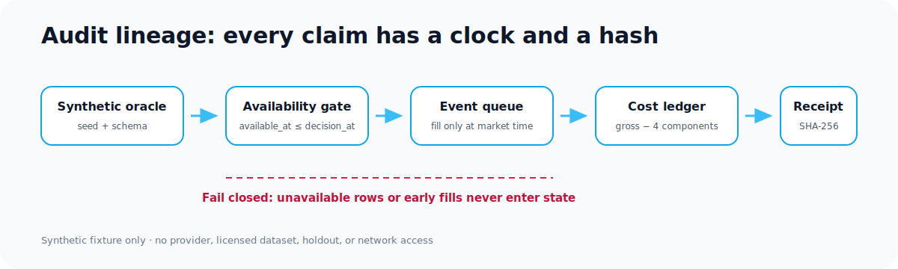

# Microalpha showcase hub

Release candidate: `v0.2.0`

Reviewed product commit: `1fe57117ebcf3fcabce9048002265c914ecd28aa`

Clean-package commit: `90323a349036c17cdffef2bb97bdc0874a8aae3b`

Baseline public commit: `9abb834117820dc479246fc9486ae7301d309110`

## Positioning

Microalpha is a **quant research audit lab**: an event-driven Python system that
makes attractive but invalid backtests fail visibly. Its flagship is a
deterministic, synthetic correctness fixture—not an alpha claim.

Public targets:

- [GitHub repository](https://github.com/MateoBodon/microalpha)
- [Documentation](https://mateobodon.github.io/microalpha/)
- [CI](https://github.com/MateoBodon/microalpha/actions/workflows/ci.yml)
- [Release](https://github.com/MateoBodon/microalpha/releases/tag/v0.2.0)

## The proof

| Failure injected | Naive result | Audited result | Guardrail |
| --- | ---: | ---: | --- |
| Revised value used too early | Sharpe `+20.5276` | `−0.1728` | 756 rows rejected by point-in-time gate |
| Same-tick signal and fill | Sharpe `+21.8860` | `+0.1739` | production plans wait for the next symbol event |
| Costs omitted | Sharpe `+0.5668` | `−0.6753` | exact commission/spread/impact/borrow reconciliation |
| Best of 128 noise models | Sharpe `+1.3802` | OOS `−1.2781` | centered max-statistic `p=0.601` |

The labeled planted control is detected at `p=0.001`. Receipt SHA-256:
`6e36c2397696d7e9eecbd058cbfc1ba522c8ffba7e5798224de86b20457b6575`.
The receipt binds the seed, input arrays, generator version, generator source,
and every canonical output.

## Before and after

| Dimension | Previous public main | Reviewed product |
| --- | ---: | ---: |
| First-30-second clarity | `2.0 / 5` | `4.9 / 5` |
| Engineering proof | `3.0 / 5` | `4.7 / 5` |
| Scientific safeguards | `2.4 / 5` | `4.8 / 5` |
| Interview memorability | `2.0 / 5` | `4.9 / 5` |
| Claim honesty | `4.0 / 5` | `5.0 / 5` |
| Full tests | 128 public-CI tests | 146 local tests, all passing |
| Coverage | 77% | 77.73% |
| Deterministic product receipt | none | source-bound SHA-256 receipt |
| Clean install to first proof | sample/report path `27.161 s` | final clean clone: install `12.183 s`, cold demo `10.488 s`, total `22.671 s` |

The final independent reviews found no remaining P0 or P1 product/scientific
issue. Hiring-manager scores were clarity `4.9`, depth `4.7`, memorability `4.9`,
honesty `5.0`, and resume usefulness `4.9`.

## Verification receipt

- 146 tests pass with 77.73% line coverage.
- Ruff, Black, isort, focused Mypy, strict MkDocs, and link tests pass.
- Secret scanning gates the product surface; the licensed-data/private-path
  policy scans all 1,696 tracked files and 1,073 data files.
- The Audit Lab regenerates byte-for-byte from clean directories; CI repeats it
  on Python 3.10, 3.11, and 3.12.
- A clean-built `0.2.0` wheel installs, reports its version, and reproduces the
  canonical receipt without licensed data.
- A fresh clone stays clean after source installation and Audit Lab regeneration;
  generated package metadata is ignored rather than versioned.
- Terminal-tick orders fail closed, asynchronous multi-asset plans wait for the
  ordered symbol, and deferred fills retain originating-rebalance diagnostics.

## Honest boundaries

- Audit Lab is a synthetic oracle fixture. Its positive controls are software
  tests, not evidence of market predictability.
- Cost models are configurable simulations, not universal venue calibration.
- Point-in-time safety still depends on correct upstream availability metadata.
- The licensed 2017–2022 case study is negative evidence of disciplined
  falsification; the 2023–2025 confirmation set remains sealed.
- Full-package Mypy still has legacy debt; CI types the new and correctness-
  critical surface rather than claiming full static coverage.

## Resume and interview explanation

**Resume:** Built an event-driven quantitative research audit lab that injects
four common backtest failures—data leakage, impossible execution, omitted costs,
and model-selection bias—and proves chronology, point-in-time, walk-forward, and
multiple-testing controls remove the illusion with deterministic, source-bound
evidence.

**Interview:** Start with the paired Audit Lab visual, explain why a positive
Sharpe is not the evaluator, then walk through the clock boundary
(`signal → plan → matching market event → fill`), the explicit benchmark-
differential null, exact cost reconciliation, and the receipt. End with the
negative licensed-data case study as evidence that the same system refuses weak
claims.

## Highest-value next improvement

Add an end-to-end point-in-time tabular join API that carries availability
metadata from ingestion through feature construction, then expose one small
public dataset adapter. The current gate is explicit and tested; this would make
the provenance contract easier to adopt outside the synthetic fixture.
