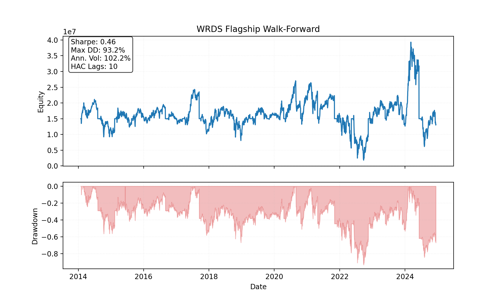
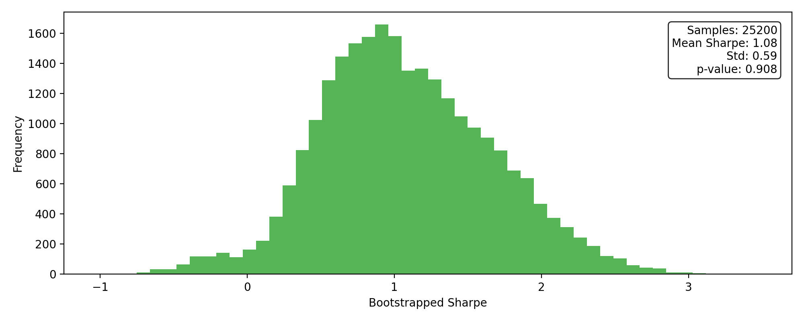
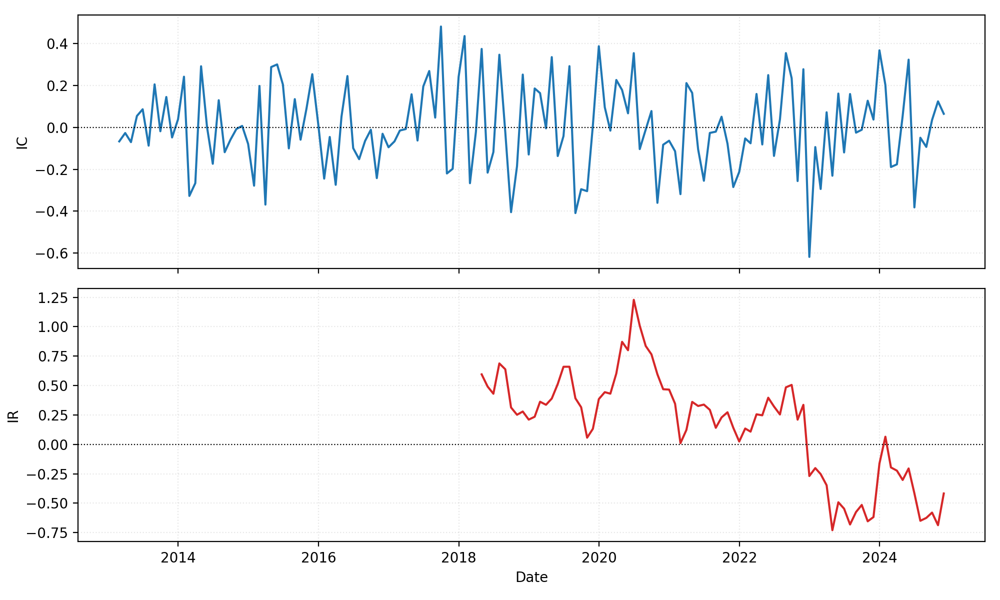
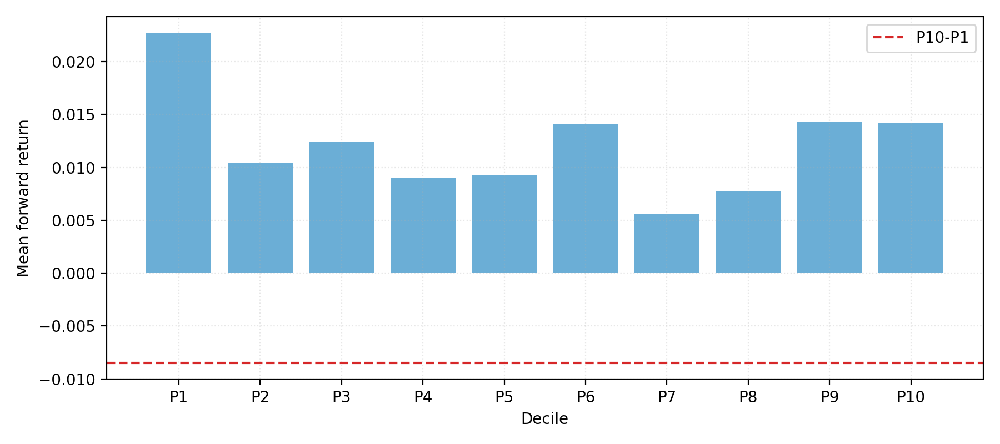
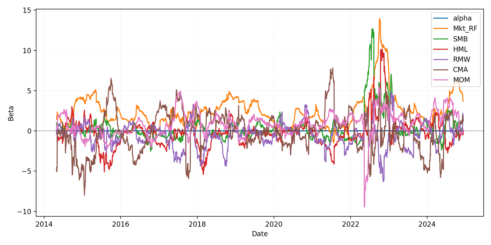

# WRDS Walk-Forward Results (Flagship Momentum)

> Latest run: **2025-11-12T08-51-11Z-65187e4** (`configs/wfv_flagship_wrds.yaml`, 2012-01-03 → 2024-12-11, 21 folds with 9-month forward tests)

## Performance Snapshot

| Metric | Value |
| --- | ---:|
| Sharpe_HAC | 0.46 |
| MAR | -0.01 |
| Max Drawdown | 93.20% |
| Turnover | $2.23B |
| SPA p-value | 0.454 |

## Key Visuals











## SPA & Factor Highlights

- Hansen SPA best model: **top_frac=0.25, turnover_target_pct_adv=0.10** with p-value **0.454** (2,000 stationary bootstrap draws, block=63). See `reports/summaries/wrds_flagship_spa.md`.
- FF5 + MOM regression (HAC lags=5):

```
| Factor | Beta | t-stat |
| --- | ---:| ---:|
| Alpha | 0.0007 | 0.61 |
| Mkt_RF | 2.2319 | 6.28 |
| SMB | 0.3238 | 1.35 |
| HML | -0.7878 | -2.87 |
| RMW | -0.6352 | -2.11 |
| CMA | -0.3157 | -0.76 |
| MOM | 0.3266 | 1.64 |
```

## Capacity & Turnover

- Average daily turnover: ~$0.81MM (≈5.4% of the $15MM book), total turnover $2.23B across 2,541 traded days.
- Portfolio heat cap 3.5× gross exposure; engine never breached the limit during this run.
- Active sleeves obey max 10 names per sector with ADV floor $30,000,000.

## Notes

- Signals derived from WRDS flagship universe (`wrds_cache/universes/flagship_sector_neutral.csv`) with 12M lookback / 1M skip and ADV ≥ $30MM.
- Execution assumptions: 5 bps explicit commission, square-root impact calibrated to 35MM ADV, borrow spread floor 8 bps, TWAP slices=6.
- Training window: 3 years; testing window: 189 trading days (~9 months) per fold, yielding 21 folds that span 2012 through Q4 2024.

Published artifacts (PNG/MD/JSON summaries) live under `docs/img/wrds_flagship/2025-11-12T08-51-11Z-65187e4/` and `reports/summaries/wrds_flagship*.{md,json}` for reproducibility.
