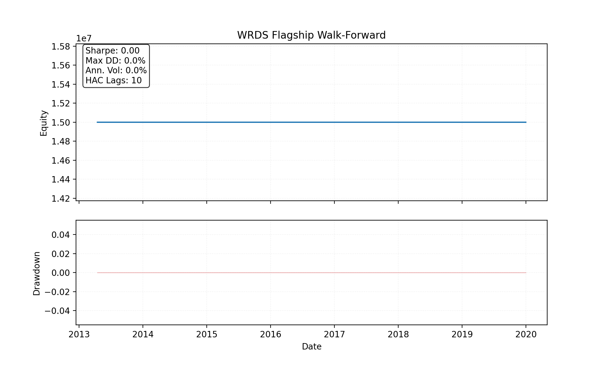
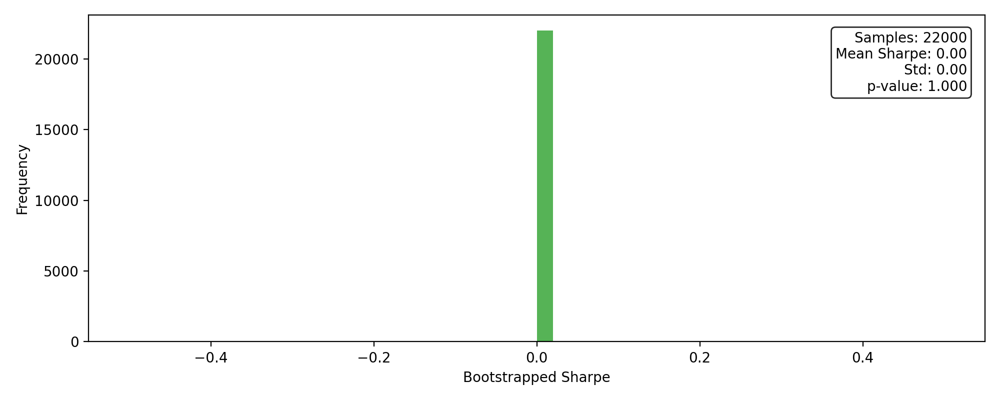
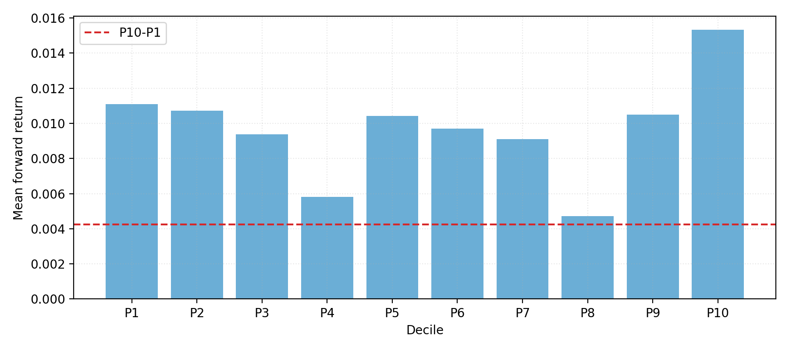
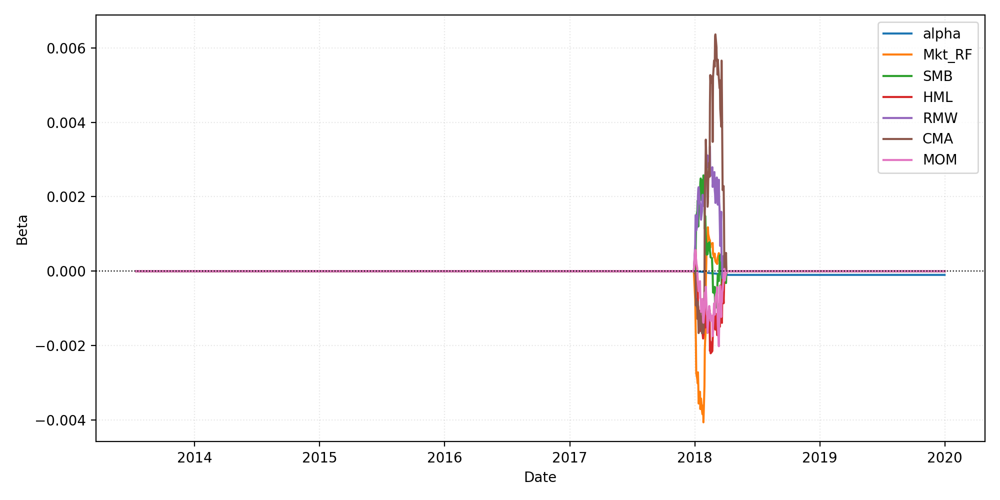

# WRDS Walk-Forward Results (Flagship Momentum)

> Latest run: **2025-12-23T19-40-24Z-ff2979d** (`configs/wfv_flagship_wrds.yaml`, 2005-01-03 -> 2020-11-17, 20 folds with 252-day forward tests (~12.0 months))

## Performance Snapshot

| Metric | Value |
| --- | ---:|
| Sharpe_HAC | 0.00 |
| MAR | 0.00 |
| Max Drawdown | 0.00% |
| Turnover | $0.00 |
| Reality Check p-value | 1.000 |
| SPA p-value | n/a |

## Run is degenerate

This run is not interpretable for performance claims:
- num_trades == 0 (no executed trades)
- returns variance is zero (flat equity curve)

## Exposure Summary

| Metric | Value |
| --- | ---:|
| Avg net exposure | 0.00% |
| Avg gross exposure | 0.00% |
| Max net exposure | 0.00% |
| Max gross exposure | 0.00% |

_Exposure time series is recorded in equity_curve.csv._

## Cost Breakdown

| Category | Total |
| --- | ---:|
| Commission | $0 |
| Slippage | $0 |
| Borrow | n/a |
| Total | $0 |

## Key Visuals










## SPA & Factor Highlights

- SPA degenerate: all strategies have zero variance
- FF5 + MOM regression (HAC lags=5):

```
| Factor | Beta | t-stat |
| --- | ---:| ---:|
| Alpha | -0.0000 | -10.98 |
| Mkt_RF | 0.0000 | 0.10 |
| SMB | 0.0002 | 0.89 |
| HML | 0.0006 | 2.01 |
| RMW | 0.0002 | 0.68 |
| CMA | -0.0007 | -1.48 |
| MOM | 0.0001 | 0.58 |
```

## Capacity & Turnover

- Average daily turnover: ~$0.00 (total $0.00) across N/A traded days.
- Portfolio heat cap enforced via max positions per sector and ADV floor; no guardrail breaches detected.

## Notes

- Signals derived from the WRDS flagship universe with 12M lookback / 1M skip and ADV >= $50.00MM.
- Training window spans 756 trading days; forward tests run 252 days each.
- Target turnover ≈ 3.00% of ADV with max 8 positions per sector.
- Execution assumes TWAP slicing with linear+sqrt impact, 5 bps commissions, and borrow spread floor of 8 bps.

Published artifacts (PNG/MD/JSON summaries) live under `docs/img/wrds_flagship/2025-12-23T19-40-24Z-ff2979d` and reports/summaries for reproducibility.
