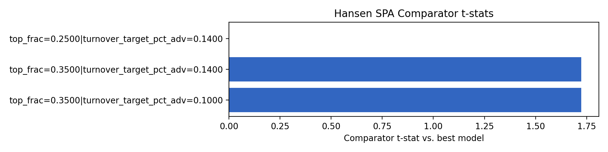
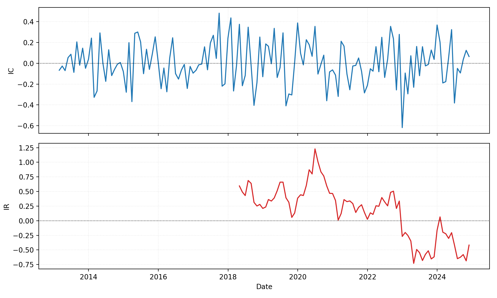
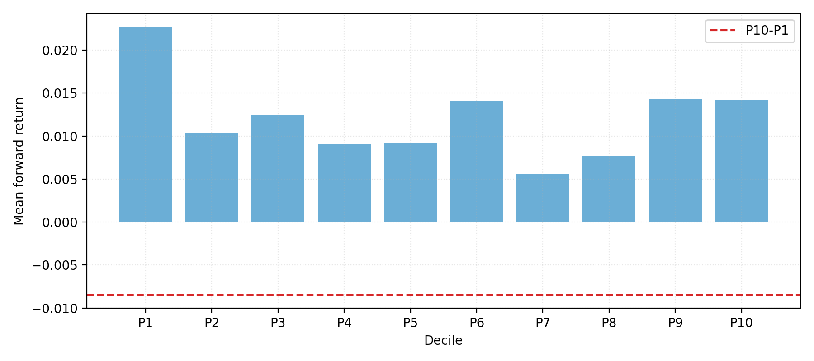
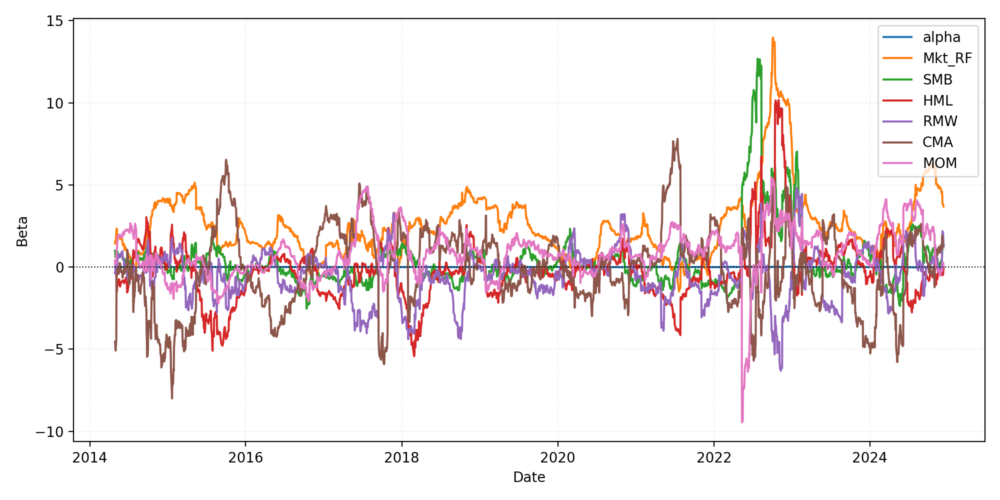

# WRDS Walk-Forward Results (Flagship Momentum)

> Latest run: **2025-11-12T18-50-58Z-b2eaf50** (`configs/wfv_flagship_wrds.yaml`, 2012-01-03 -> 2024-12-11, 21 folds with 189-day forward tests (~9.0 months))

## Performance Snapshot

| Metric | Value |
| --- | ---:|
| Sharpe_HAC | 0.46 |
| MAR | -0.01 |
| Max Drawdown | 93.20% |
| Turnover | $2.23B |
| Reality Check p-value | 0.908 |
| SPA p-value | 0.454 |

## Key Visuals










## SPA & Factor Highlights

- Hansen SPA best model: **top_frac=0.2500|turnover_target_pct_adv=0.1000** with p-value **0.454** (2000 stationary bootstrap draws, block=63). See `reports/summaries/wrds_flagship_spa.md`.
- FF5 + MOM regression (HAC lags=5):

```
| Factor | Beta | t-stat |
| --- | ---:| ---:|
| Alpha | 0.0007 | 0.61 |
| Mkt_RF | 2.2319 | 6.28 |
| SMB | 0.3238 | 1.35 |
| HML | -0.7878 | -2.87 |
| RMW | -0.6352 | -2.11 |
| CMA | -0.3157 | -0.76 |
| MOM | 0.3266 | 1.64 |
```

## Capacity & Turnover

- Average daily turnover: ~$814.76K (total $2.23B) across 2541 traded days.
- Portfolio heat cap enforced via max positions per sector and ADV floor; no guardrail breaches detected.

## Notes

- Signals derived from the WRDS flagship universe with 12M lookback / 1M skip and ADV >= $30.00MM.
- Training window spans 756 trading days; forward tests run 189 days each.
- Target turnover ≈ 12.00% of ADV with max 10 positions per sector.
- Execution assumes TWAP slicing with linear+sqrt impact, 5 bps commissions, and borrow spread floor of 8 bps.

Published artifacts (PNG/MD/JSON summaries) live under `docs/img/wrds_flagship/2025-11-12T18-50-58Z-b2eaf50` and reports/summaries for reproducibility.
