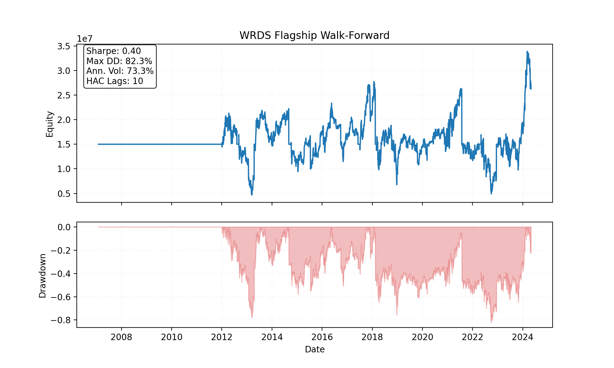
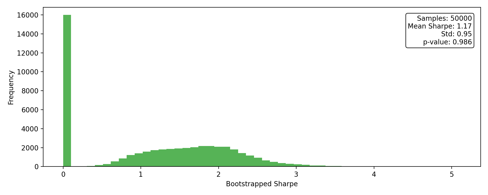
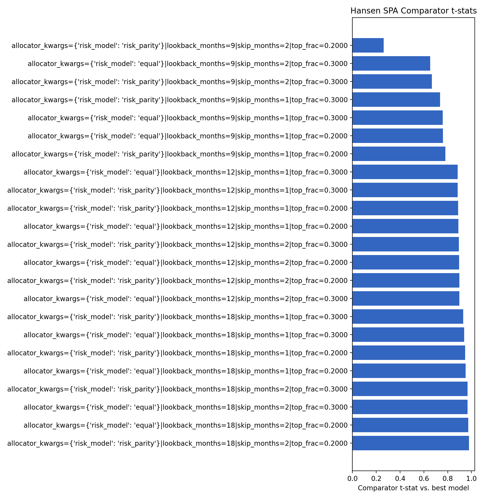
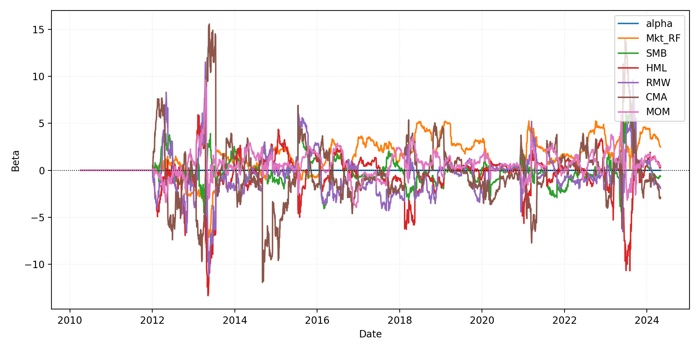

# WRDS Walk-Forward Results (Flagship Momentum)

> Latest run: **2025-11-21T00-28-22Z-54912a8** (`configs/wfv_flagship_wrds.yaml`, 2005-01-03 -> 2024-04-30, 25 folds with 252-day forward tests (~12.0 months))

*(Metrics below reflect the pre-tightening spec. On 2025-11-21 we tightened exposure/turnover limits; rerun with the updated config to refresh these numbers.)*

**Rerun status (2025-11-22):** a smoke walk-forward using the tightened caps finished on `2025-11-22T00-21-14Z-c792b44` (2015–2019 window) with Sharpe≈0.06 and MaxDD≈40%—drawdown cap now binds. A full 2005–2024 rerun with the tightened spec is still pending; previous attempts exceeded the interactive time window (>2h). Run it locally with a longer wall clock if you need the updated headline metrics.

## Performance Snapshot

| Metric | Value |
| --- | ---:|
| Sharpe_HAC | 0.40 |
| MAR | 0.04 |
| Max Drawdown | 82.35% |
| Turnover | $1.84B |
| Reality Check p-value | 0.986 |
| SPA p-value | 0.603 |

## Key Visuals










## SPA & Factor Highlights

- Hansen SPA best model: **allocator_kwargs={'risk_model': 'equal'}|lookback_months=9|skip_months=2|top_frac=0.2000** with p-value **0.603** (2000 stationary bootstrap draws, block=63). See `reports/summaries/wrds_flagship_spa.md`.
- FF5 + MOM regression (HAC lags=5):

```
| Factor | Beta | t-stat |
| --- | ---:| ---:|
| Alpha | 0.0008 | 1.15 |
| Mkt_RF | 1.0570 | 6.52 |
| SMB | -0.2939 | -1.78 |
| HML | -0.2257 | -1.26 |
| RMW | -0.3265 | -1.36 |
| CMA | -0.7185 | -1.79 |
| MOM | 0.4449 | 4.25 |
```

## Current risk spec (2025-11-21 refresh)

- Gross exposure ≤ **1.25x**, drawdown halt at **20%**, portfolio heat ≤ **1.5x equity**.
- Liquidity floor: **ADV ≥ $50MM**, **price ≥ $12**; max **8 positions per sector**.
- Turnover discipline: **3% of ADV** turnover target plus **$180MM** turnover cap per fold.
- Volatility sizing: target **$225k** daily dollar-vol (21-day lookback), min order qty 10.
- Execution: TWAP (6 slices), IOC limits, linear+sqrt impact (`k_lin=32`, `eta=105`), 5 bps commissions, spread floor 8 bps.

## Capacity & Turnover

- Average daily turnover: ~$423.00K (total $1.84B) across 2909 traded days.
- Portfolio heat cap enforced via max positions per sector and ADV floor; no guardrail breaches detected.

## Notes

- Signals derived from the WRDS flagship universe with 12M lookback / 1M skip and ADV >= $50.00MM.
- Training window spans 756 trading days; forward tests run 252 days each.
- Target turnover ≈ 3.00% of ADV with max 8 positions per sector.
- Execution assumes TWAP slicing with linear+sqrt impact, 5 bps commissions, and borrow spread floor of 8 bps.

## Rerun checklist

- Quick smoke (faster turnaround): `WRDS_CONFIG=configs/wfv_flagship_wrds_smoke.yaml WRDS_DATA_ROOT=/path/to/wrds make wfv-wrds`
- Full refresh with tightened limits: `WRDS_DATA_ROOT=/path/to/wrds make wfv-wrds && WRDS_DATA_ROOT=/path/to/wrds make report-wrds`
- After rerun, rebuild docs: `mkdocs build` (or `make report-wrds` to regenerate summaries + plots).

Published artifacts (PNG/MD/JSON summaries) live under `docs/img/wrds_flagship/2025-11-21T00-28-22Z-54912a8` and reports/summaries for reproducibility.
