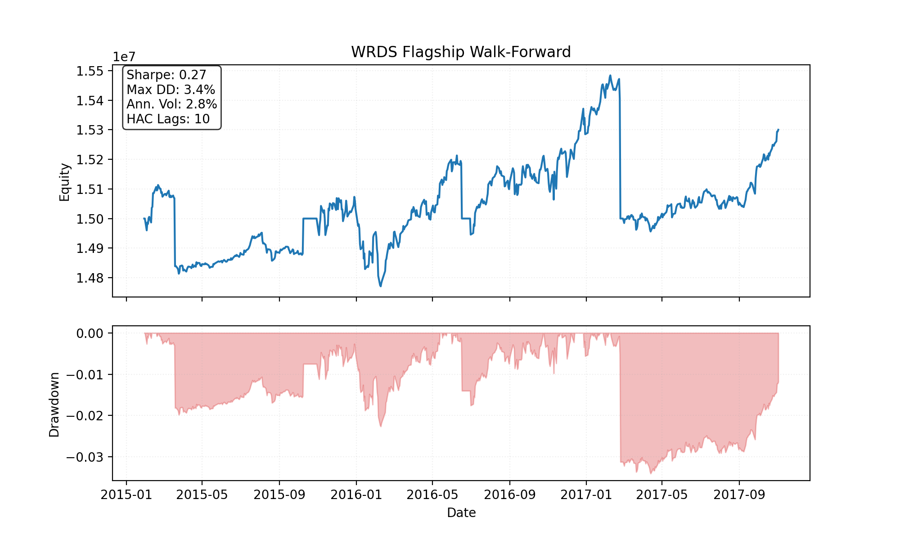
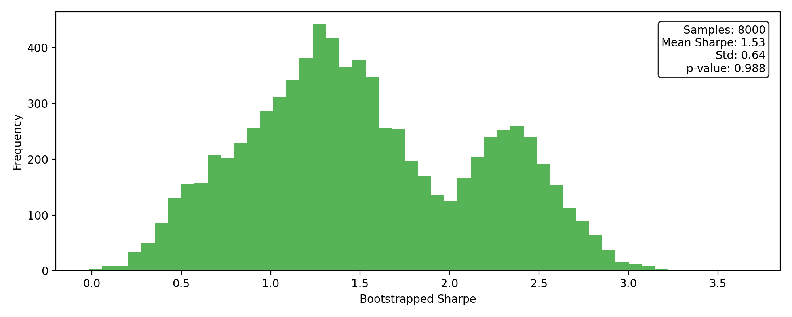
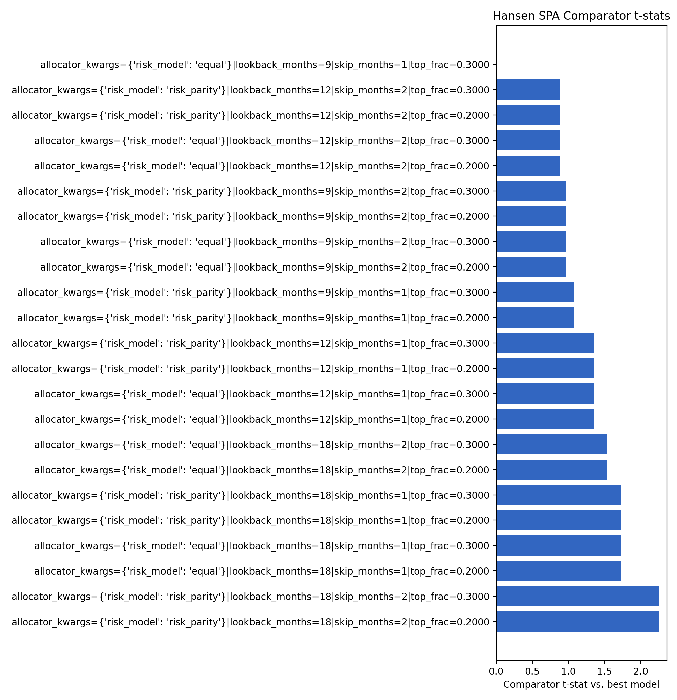
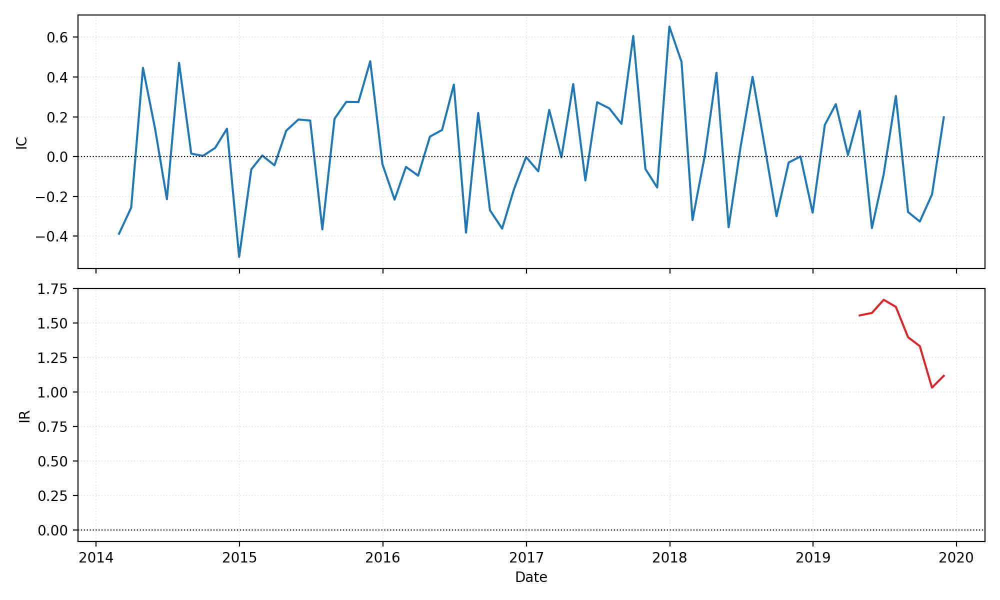
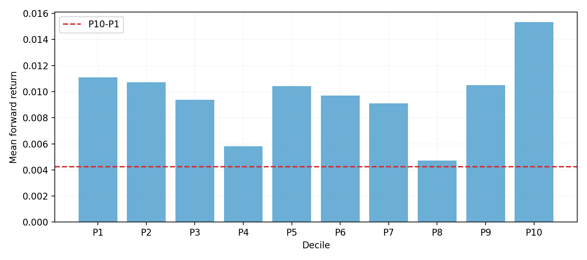
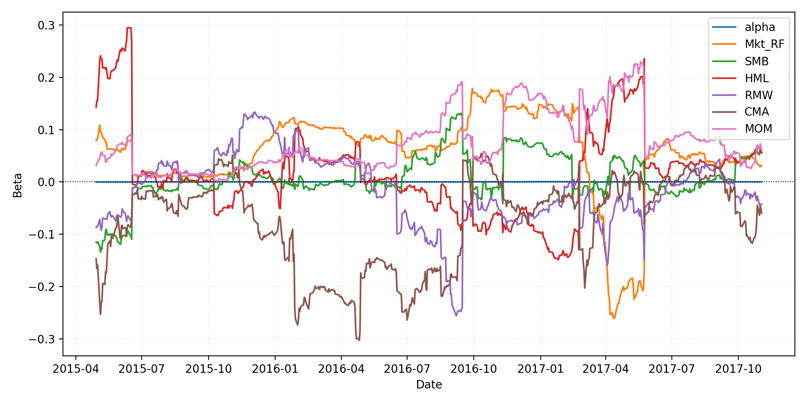

# WRDS Walk-Forward Results (Flagship Momentum)

> Latest run: **2026-01-25T22-58-24Z-4d08d18** (`configs/wfv_flagship_wrds.yaml`, 2013-01-02 -> 2017-11-02, 4 folds with 252-day forward tests (~12.0 months))

## Performance Snapshot

| Metric | Value |
| --- | ---:|
| Sharpe_HAC | 0.27 |
| MAR | 0.21 |
| Max Drawdown | 3.41% |
| Turnover | $14.75MM |
| Reality Check p-value | 0.988 |
| SPA p-value | 0.015 |

## Baselines

| Series | Sharpe_HAC | MaxDD | CAGR | Turnover |
| --- | ---:| ---:| ---:| ---:|
| Flagship (net) | 0.27 | 3.41% | 0.72% | 14748925.2100 |
| Equal-weight universe | 1.12 | 15.89% | 14.96% | 0.0000 |
| Market proxy | 0.00 | 0.00% | 0.00% | 0.0000 |
| Momentum 12-1 | 2.58 | 9.07% | 67.83% | 3.7500 |
| Cash / RF | 0.00 | 0.00% | 0.00% | 0.0000 |


- Baselines CSV: `../artifacts/wrds_flagship/2026-01-25T22-58-24Z-4d08d18/baselines.csv`
- Momentum baseline: lookback=12M skip=1M long_short=False
- Turnover for baselines is unit-notional weight turnover; flagship uses reported total_turnover.

## Exposure Summary

| Metric | Value |
| --- | ---:|
| Avg net exposure | 6.39% |
| Avg gross exposure | 9.96% |
| Max net exposure | 16.19% |
| Max gross exposure | 16.19% |

_Exposure time series is recorded in equity_curve.csv._

## Cost Breakdown

| Category | Total |
| --- | ---:|
| Commission | $125 |
| Slippage | $0 |
| Borrow | n/a |
| Total | $125 |

## Key Visuals













## SPA & Factor Highlights

- Hansen SPA best model: **allocator_kwargs={'risk_model': 'equal'}|lookback_months=9|skip_months=1|top_frac=0.2000** with p-value **0.015** (2000 stationary bootstrap draws, block=63). See `reports/summaries/wrds_flagship_spa.md`.
- FF5 + MOM regression (HAC lags=5):

```
| Factor | Beta | t-stat |
| --- | ---:| ---:|
| Alpha | -0.0000 | -0.24 |
| Mkt_RF | 0.0663 | 5.89 |
| SMB | 0.0044 | 0.30 |
| HML | 0.0256 | 1.04 |
| RMW | -0.0251 | -1.46 |
| CMA | -0.0769 | -3.70 |
| MOM | 0.0413 | 3.89 |
_Frequency: returns daily, factors daily; overlap 2015-01-29 to 2017-11-02; n_obs=698._
```

## Capacity & Turnover

- Average daily turnover: ~$21.13K (total $14.75MM) across 670 traded days.
- Portfolio heat cap enforced via max positions per sector and ADV floor; no guardrail breaches detected.

## Notes

- Signals derived from the WRDS flagship universe with 12M lookback / 1M skip and ADV >= $50.00MM.
- Training window spans 756 trading days; forward tests run 252 days each.
- Target turnover ≈ 3.00% of ADV with max 8 positions per sector.
- Execution assumes TWAP slicing with linear+sqrt impact, 5 bps commissions, and borrow spread floor of 8 bps.

Published artifacts (PNG/MD/JSON summaries) live under `docs/img/wrds_flagship/2026-01-25T22-58-24Z-4d08d18` and reports/summaries for reproducibility.
