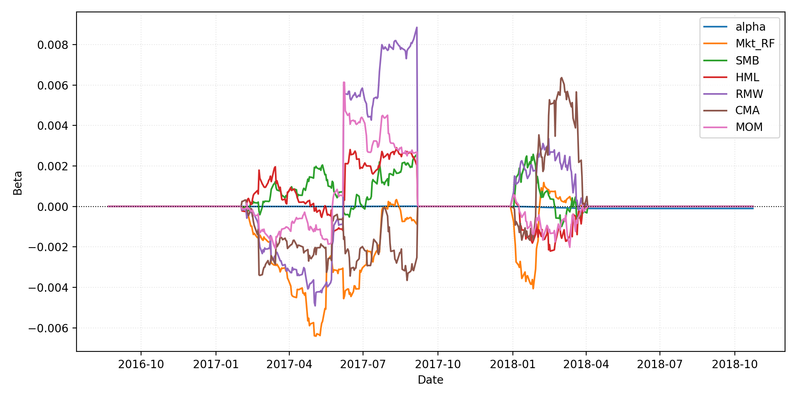

# WRDS Walk-Forward Results (Flagship Momentum)

> Latest run: **2025-12-21T21-28-14Z-33c9c2a** (`configs/wfv_flagship_wrds_smoke.yaml`, 2015-01-05 -> 2018-10-23, 7 folds with 126-day forward tests (~6.0 months))

## Performance Snapshot

| Metric | Value |
| --- | ---:|
| Sharpe_HAC | 0.00 |
| MAR | 0.00 |
| Max Drawdown | 0.07% |
| Turnover | $434.24K |
| Reality Check p-value | 1.000 |
| SPA p-value | 1.000 |

## Exposure Summary

| Metric | Value |
| --- | ---:|
| Avg net exposure | -0.06% |
| Avg gross exposure | 0.11% |
| Max net exposure | 0.70% |
| Max gross exposure | 1.54% |

_Exposure time series is recorded in equity_curve.csv._

## Cost Breakdown

| Category | Total |
| --- | ---:|
| Commission | $4 |
| Slippage | $0 |
| Borrow | n/a |
| Total | $4 |

## Key Visuals




## SPA & Factor Highlights

- Hansen SPA best model: **allocator_kwargs={'risk_model': 'equal'}|lookback_months=12|skip_months=1|top_frac=0.2000** with p-value **1.000** (500 stationary bootstrap draws, block=63). See `reports/summaries/wrds_flagship_smoke_spa.md`.
- FF5 + MOM regression (HAC lags=5):

```
| Factor | Beta | t-stat |
| --- | ---:| ---:|
| Alpha | -0.0000 | -7.10 |
| Mkt_RF | 0.0001 | 0.42 |
| SMB | 0.0000 | 0.11 |
| HML | 0.0009 | 1.48 |
| RMW | 0.0008 | 1.10 |
| CMA | -0.0019 | -2.00 |
| MOM | -0.0003 | -0.77 |
```

## Capacity & Turnover

- Average daily turnover: ~$711.86 (total $434.24K) across 87 traded days.
- Portfolio heat cap enforced via max positions per sector and ADV floor; no guardrail breaches detected.

## Notes

- Signals derived from the WRDS flagship universe with 12M lookback / 1M skip and ADV >= $50.00MM.
- Training window spans 504 trading days; forward tests run 126 days each.
- Target turnover ≈ 3.00% of ADV with max 8 positions per sector.
- Execution assumes TWAP slicing with linear+sqrt impact, 5 bps commissions, and borrow spread floor of 8 bps.

Published artifacts (PNG/MD/JSON summaries) live under `docs/img/wrds_flagship_smoke/2025-12-21T21-28-14Z-33c9c2a` and reports/summaries for reproducibility.
