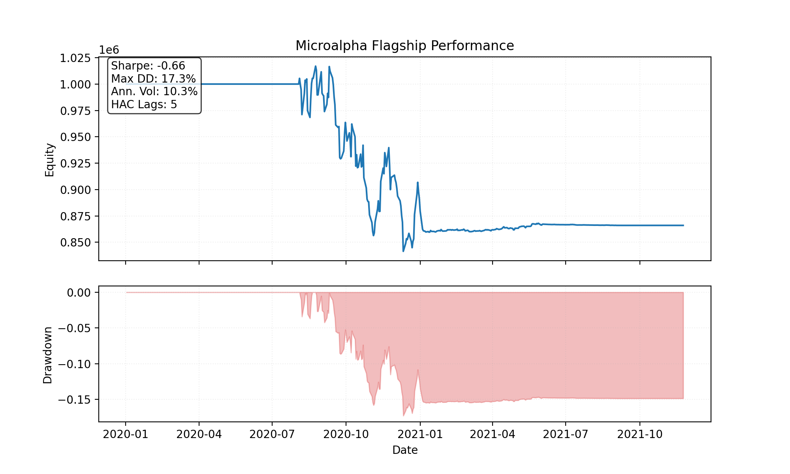
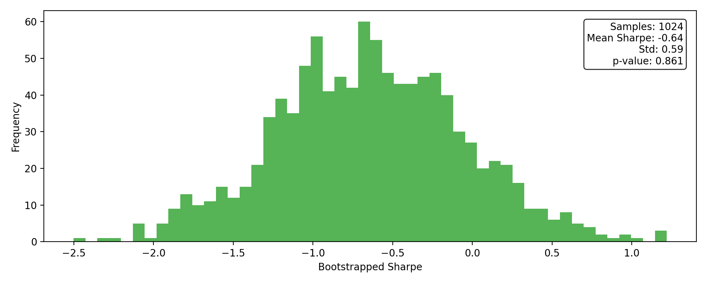

# Flagship Momentum Case Study

## Performance Snapshot

| Metric | Value |
| --- | ---:|
| Sharpe_HAC | -0.66 |
| MAR | -0.41 |
| MaxDD | 17.26% |
| Turnover | $1,211,972 |
| RealityCheck_p_value | 0.861 |

## Visuals

## Bootstrap Reality Check

- Samples: 1024
- Mean Sharpe: -0.64
- Std: 0.59
- 95% CI: [-1.81, 0.56]
- p-value: 0.861

## Top Exposures

| Symbol | Qty | Market Value | Weight |
| --- | ---:| ---:| ---:|
| ALFA | 2 | $171 | 0.02% |
