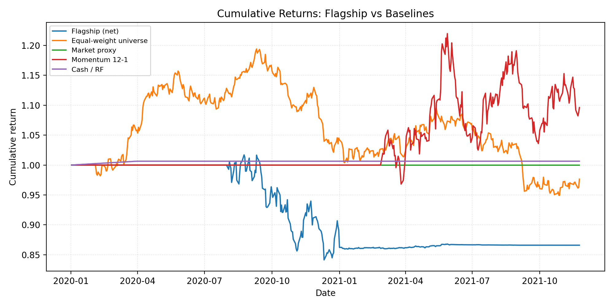

# Flagship Momentum Case Study

## Performance Snapshot

| Metric | Value |
| --- | ---:|
| Sharpe_HAC | -0.65 |
| MAR | -0.41 |
| MaxDD | 17.26% |
| Turnover | $1,211,972 |
| RealityCheck_p_value | 0.861 |

## Baselines

| Series | Sharpe_HAC | MaxDD | CAGR | Turnover |
| --- | ---:| ---:| ---:| ---:|
| Flagship (net) | -0.65 | 17.26% | -7.06% | 1211971.8448 |
| Equal-weight universe | -0.06 | 20.49% | -1.26% | 0.0000 |
| Market proxy | 0.00 | 0.00% | 0.00% | 0.0000 |
| Momentum 12-1 | 0.60 | 15.96% | 12.73% | 2.0000 |
| Cash / RF | 6.12 | 0.00% | 0.33% | 0.0000 |

- Baselines CSV: `../../artifacts/sample_flagship/2025-12-23T21-59-20Z-ba5b480/baselines.csv`
- Momentum baseline: lookback=12M skip=1M long_short=False
- Turnover for baselines is unit-notional weight turnover; flagship uses reported total_turnover.

## Exposure Summary

| Metric | Value |
| --- | ---:|
| Avg net exposure | 15.00% |
| Avg gross exposure | 15.00% |
| Max gross exposure | 67.85% |
| Max net exposure | 67.85% |

_Exposure time series is recorded in equity_curve.csv._

## Visuals

## Bootstrap Reality Check

- Samples: 1024
- Mean Sharpe: -0.63
- Std: 0.58
- 95% CI: [-1.79, 0.56]
- p-value: 0.861

## Top Exposures

| Symbol | Qty | Market Value | Weight |
| --- | ---:| ---:| ---:|
| ALFA | 2 | $171 | 0.02% |

## Cost & Metadata Robustness

**Cost sensitivity (ex-post scaling of recorded costs)**

| Multiplier | Sharpe | MaxDD | CAGR | MAR | Cost drag (bps/yr) |
| --- | ---:| ---:| ---:| ---:| ---:|
| 0.50 | -0.65 | 17.26% | -7.06% | -0.41 | -0.0 |
| 1.00 | -0.65 | 17.26% | -7.06% | -0.41 | 0.0 |
| 2.00 | -0.65 | 17.26% | -7.06% | -0.41 | 0.0 |

_Scales recorded commissions and slippage; borrow costs are not logged and are excluded. No re-simulation performed._

**Cost breakdown (totals)**

| Category | Total |
| --- | ---:|
| Commission | $5 |
| Slippage | $0 |
| Borrow | n/a |
| Total | $5 |

**Metadata coverage (liquidity/borrow inputs)**

| Metric | Value |
| --- | ---:|
| Notional with ADV | 100.00% |
| Notional with spread_bps | 100.00% |
| Short notional with borrow fee | 100.00% |

Top fallback symbols (trade counts):
- ALFA: adv_missing=0, spread_missing=0, borrow_missing=0

_Coverage based on metadata CSV (if provided). Missing values imply default ADV/spread/borrow costs were used by the simulator._
