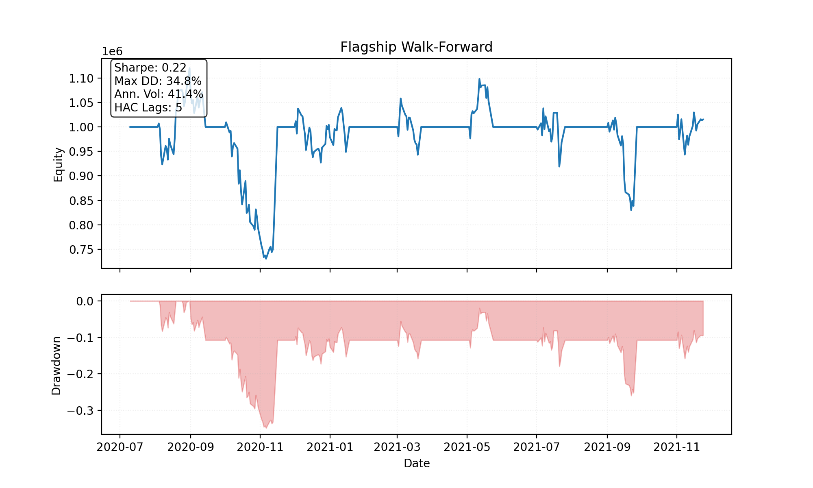
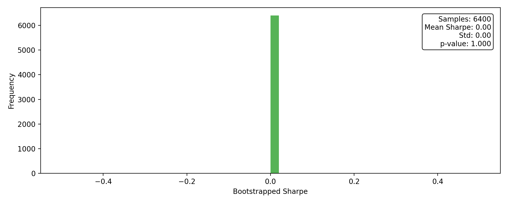

# Flagship Walk-Forward

## Performance Snapshot

| Metric | Value |
| --- | ---:|
| Sharpe_HAC | 0.22 |
| MAR | 0.03 |
| MaxDD | 34.79% |
| Turnover | $28,525,695 |
| RealityCheck_p_value | 1.000 |

## Visuals

## Bootstrap Reality Check

- Samples: 6400
- Mean Sharpe: 0.00
- Std: 0.00
- 95% CI: [0.00, 0.00]
- p-value: 1.000

## Top Exposures

| Symbol | Qty | Market Value | Weight |
| --- | ---:| ---:| ---:|
| ZETA | 42204 | $1,143,721 | 112.65% |
| BETA | 31525 | $754,333 | 74.30% |
| GAMM | -18684 | $-590,860 | -58.20% |
| ALFA | -6175 | $-528,997 | -52.10% |

## Factor Regression (FF3 sample)

| Factor | Beta | t-stat |
| --- | ---:| ---:|
| Alpha | -0.0055 | -1.42 |
| Mkt_RF | 10.7236 | 1.74 |
| SMB | 1.4014 | 0.12 |
| HML | -13.1416 | -0.77 |

_Computed against `data/factors/ff3_sample.csv` using Newey-West standard errors._
