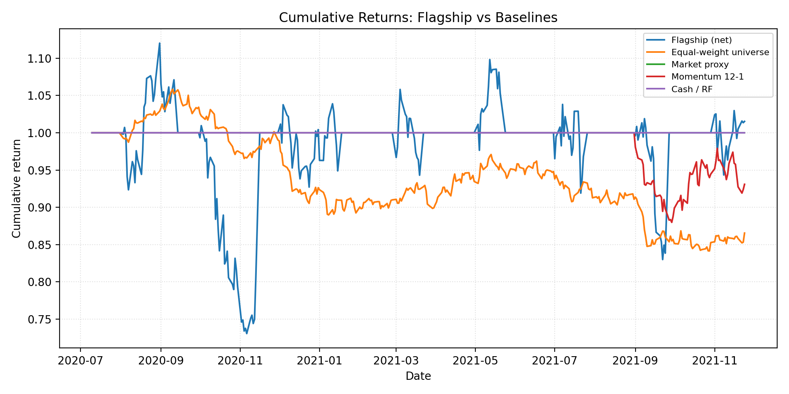

# Flagship Walk-Forward

## Performance Snapshot

| Metric | Value |
| --- | ---:|
| Sharpe_HAC | 0.23 |
| MAR | 0.03 |
| MaxDD | 34.79% |
| Turnover | $28,525,695 |
| RealityCheck_p_value | 1.000 |

## Baselines

| Series | Sharpe_HAC | MaxDD | CAGR | Turnover |
| --- | ---:| ---:| ---:| ---:|
| Flagship (net) | 0.23 | 34.79% | 1.07% | 28525695.1044 |
| Equal-weight universe | -0.93 | 20.49% | -10.07% | 0.0000 |
| Market proxy | 0.00 | 0.00% | 0.00% | 0.0000 |
| Momentum 12-1 | -1.35 | 10.30% | -25.62% | 0.0000 |
| Cash / RF | 0.00 | 0.00% | 0.00% | 0.0000 |

- Baselines CSV: `../../artifacts/sample_wfv/2025-12-23T18-39-59Z-82c14dc/baselines.csv`
- Momentum baseline: lookback=12M skip=1M long_short=False
- Turnover for baselines is unit-notional weight turnover; flagship uses reported total_turnover.

## Exposure Summary

| Metric | Value |
| --- | ---:|
| Avg net exposure | 17.37% |
| Avg gross exposure | 158.60% |
| Max gross exposure | 403.02% |
| Max net exposure | 163.52% |

_Exposure time series is recorded in equity_curve.csv._

## Visuals

## Bootstrap Reality Check

- Samples: 6400
- Mean Sharpe: 0.00
- Std: 0.00
- 95% CI: [0.00, 0.00]
- p-value: 1.000

## Top Exposures

| Symbol | Qty | Market Value | Weight |
| --- | ---:| ---:| ---:|
| ZETA | 42204 | $1,143,721 | 112.65% |
| BETA | 31525 | $754,333 | 74.30% |
| GAMM | -18684 | $-590,860 | -58.20% |
| ALFA | -6175 | $-528,997 | -52.10% |

## Factor Regression (FF3 sample)

| Factor | Beta | t-stat |
| --- | ---:| ---:|
| Alpha | -0.0058 | -0.39 |
| Mkt_RF | 17.2808 | 0.81 |
| SMB | -33.6482 | -0.72 |
| HML | -21.0700 | -0.49 |

_Frequency: returns daily, factors weekly; overlap 2020-07-10 to 2021-11-24; n_obs=73 (resampled returns)._

_Computed against `data/factors/ff3_sample.csv` using Newey-West standard errors._

## Cost & Metadata Robustness

**Cost sensitivity (ex-post scaling of recorded costs)**

| Multiplier | Sharpe | MaxDD | CAGR | MAR | Cost drag (bps/yr) |
| --- | ---:| ---:| ---:| ---:| ---:|
| 0.50 | 0.23 | 34.79% | 1.08% | 0.03 | -1.2 |
| 1.00 | 0.23 | 34.79% | 1.07% | 0.03 | 0.0 |
| 2.00 | 0.23 | 34.79% | 1.04% | 0.03 | 2.5 |

_Scales recorded commissions and slippage; borrow costs (if present) are logged separately and not scaled. No re-simulation performed._

**Cost breakdown (totals)**

| Category | Total |
| --- | ---:|
| Commission | $345 |
| Slippage | $0 |
| Borrow | $28,539 |
| Total | $28,884 |

**Metadata coverage (liquidity/borrow inputs)**

| Metric | Value |
| --- | ---:|
| Notional with ADV | 100.00% |
| Notional with spread_bps | 100.00% |
| Short notional with borrow fee | 100.00% |

Top fallback symbols (trade counts):
- BETA: adv_missing=0, spread_missing=0, borrow_missing=0
- ALFA: adv_missing=0, spread_missing=0, borrow_missing=0
- EPSI: adv_missing=0, spread_missing=0, borrow_missing=0
- ZETA: adv_missing=0, spread_missing=0, borrow_missing=0
- GAMM: adv_missing=0, spread_missing=0, borrow_missing=0
- DELT: adv_missing=0, spread_missing=0, borrow_missing=0

_Coverage based on metadata CSV (if provided). Missing values imply default ADV/spread/borrow costs were used by the simulator._
