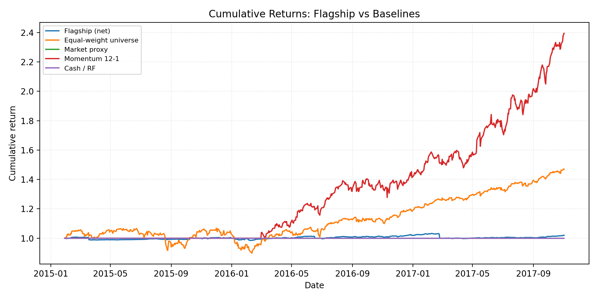

# WRDS Flagship Walk-Forward

## Selection Constraints

- Non-degenerate: min_trades >= 1 (excluded 0 candidate(s) during selection)

## Headline Metrics

| Metric | Value |
| --- | ---:|
| Sharpe_HAC | 0.27 |
| MAR | 0.21 |
| MaxDD | 3.41% |
| Turnover | $14,748,925 |
| RealityCheck_p_value | 0.988 |
| SPA_p_value | 0.015 |

## Baselines

| Series | Sharpe_HAC | MaxDD | CAGR | Turnover |
| --- | ---:| ---:| ---:| ---:|
| Flagship (net) | 0.27 | 3.41% | 0.72% | 14748925.2100 |
| Equal-weight universe | 1.12 | 15.89% | 14.96% | 0.0000 |
| Market proxy | 0.00 | 0.00% | 0.00% | 0.0000 |
| Momentum 12-1 | 2.58 | 9.07% | 67.83% | 3.7500 |
| Cash / RF | 0.00 | 0.00% | 0.00% | 0.0000 |

- Baselines CSV: `../../artifacts/wrds_flagship/2026-01-25T22-58-24Z-4d08d18/baselines.csv`
- Momentum baseline: lookback=12M skip=1M long_short=False
- Turnover for baselines is unit-notional weight turnover; flagship uses reported total_turnover.

## Exposure Summary

| Metric | Value |
| --- | ---:|
| Avg net exposure | 6.39% |
| Avg gross exposure | 9.96% |
| Max net exposure | 16.19% |
| Max gross exposure | 16.19% |

_Exposure time series is recorded in equity_curve.csv._

## Cost Breakdown

| Category | Total |
| --- | ---:|
| Commission | $125 |
| Slippage | $0 |
| Borrow | n/a |
| Total | $125 |

## Visuals

## Hansen SPA Summary

- **Best model:** allocator_kwargs={'risk_model': 'equal'}|lookback_months=9|skip_months=1|top_frac=0.2000
- **Observed max t-stat:** 2.248
- **p-value:** 0.015
- **Bootstrap draws:** 2000 (avg block 63)

| Comparator | Mean Diff | t-stat |
| --- | ---:| ---:|
| allocator_kwargs={'risk_model': 'equal'}|lookback_months=12|skip_months=1|top_frac=0.2000 | 0.0000 | 1.36 |
| allocator_kwargs={'risk_model': 'equal'}|lookback_months=12|skip_months=1|top_frac=0.3000 | 0.0000 | 1.36 |
| allocator_kwargs={'risk_model': 'equal'}|lookback_months=12|skip_months=2|top_frac=0.2000 | 0.0000 | 0.88 |
| allocator_kwargs={'risk_model': 'equal'}|lookback_months=12|skip_months=2|top_frac=0.3000 | 0.0000 | 0.88 |
| allocator_kwargs={'risk_model': 'equal'}|lookback_months=18|skip_months=1|top_frac=0.2000 | 0.0000 | 1.73 |
| allocator_kwargs={'risk_model': 'equal'}|lookback_months=18|skip_months=1|top_frac=0.3000 | 0.0000 | 1.73 |
| allocator_kwargs={'risk_model': 'equal'}|lookback_months=18|skip_months=2|top_frac=0.2000 | 0.0000 | 1.53 |
| allocator_kwargs={'risk_model': 'equal'}|lookback_months=18|skip_months=2|top_frac=0.3000 | 0.0000 | 1.53 |
| allocator_kwargs={'risk_model': 'equal'}|lookback_months=9|skip_months=1|top_frac=0.3000 | 0.0000 | 0.00 |
| allocator_kwargs={'risk_model': 'equal'}|lookback_months=9|skip_months=2|top_frac=0.2000 | 0.0000 | 0.96 |
| allocator_kwargs={'risk_model': 'equal'}|lookback_months=9|skip_months=2|top_frac=0.3000 | 0.0000 | 0.96 |
| allocator_kwargs={'risk_model': 'risk_parity'}|lookback_months=12|skip_months=1|top_frac=0.2000 | 0.0000 | 1.36 |
| allocator_kwargs={'risk_model': 'risk_parity'}|lookback_months=12|skip_months=1|top_frac=0.3000 | 0.0000 | 1.36 |
| allocator_kwargs={'risk_model': 'risk_parity'}|lookback_months=12|skip_months=2|top_frac=0.2000 | 0.0000 | 0.88 |
| allocator_kwargs={'risk_model': 'risk_parity'}|lookback_months=12|skip_months=2|top_frac=0.3000 | 0.0000 | 0.88 |
| allocator_kwargs={'risk_model': 'risk_parity'}|lookback_months=18|skip_months=1|top_frac=0.2000 | 0.0000 | 1.73 |
| allocator_kwargs={'risk_model': 'risk_parity'}|lookback_months=18|skip_months=1|top_frac=0.3000 | 0.0000 | 1.73 |
| allocator_kwargs={'risk_model': 'risk_parity'}|lookback_months=18|skip_months=2|top_frac=0.2000 | 0.0001 | 2.25 |
| allocator_kwargs={'risk_model': 'risk_parity'}|lookback_months=18|skip_months=2|top_frac=0.3000 | 0.0001 | 2.25 |
| allocator_kwargs={'risk_model': 'risk_parity'}|lookback_months=9|skip_months=1|top_frac=0.2000 | 0.0000 | 1.08 |
| allocator_kwargs={'risk_model': 'risk_parity'}|lookback_months=9|skip_months=1|top_frac=0.3000 | 0.0000 | 1.08 |
| allocator_kwargs={'risk_model': 'risk_parity'}|lookback_months=9|skip_months=2|top_frac=0.2000 | 0.0000 | 0.96 |
| allocator_kwargs={'risk_model': 'risk_parity'}|lookback_months=9|skip_months=2|top_frac=0.3000 | 0.0000 | 0.96 |

## Factor Attribution (FF5+MOM)

| Factor | Beta | t-stat |
| --- | ---:| ---:|
| Alpha | -0.0000 | -0.24 |
| Mkt_RF | 0.0663 | 5.89 |
| SMB | 0.0044 | 0.30 |
| HML | 0.0256 | 1.04 |
| RMW | -0.0251 | -1.46 |
| CMA | -0.0769 | -3.70 |
| MOM | 0.0413 | 3.89 |
_Frequency: returns daily, factors daily; overlap 2015-01-29 to 2017-11-02; n_obs=698._
