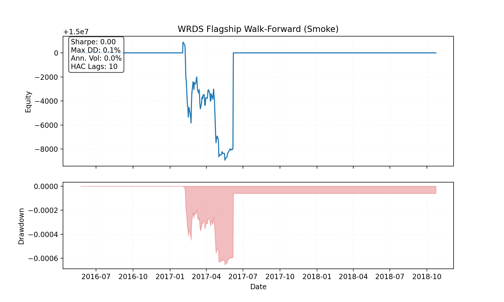

# WRDS Flagship Walk-Forward

## Headline Metrics

| Metric | Value |
| --- | ---:|
| Sharpe_HAC | 0.00 |
| MAR | 0.00 |
| MaxDD | 0.07% |
| Turnover | $434,237 |
| RealityCheck_p_value | 1.000 |
| SPA_p_value | 1.000 |

## Exposure Summary

| Metric | Value |
| --- | ---:|
| Avg net exposure | -0.06% |
| Avg gross exposure | 0.11% |
| Max net exposure | 0.70% |
| Max gross exposure | 1.54% |

_Exposure time series is recorded in equity_curve.csv._

## Cost Breakdown

| Category | Total |
| --- | ---:|
| Commission | $4 |
| Slippage | $0 |
| Borrow | n/a |
| Total | $4 |

## Visuals

## Hansen SPA Summary

- **Best model:** allocator_kwargs={'risk_model': 'equal'}|lookback_months=12|skip_months=1|top_frac=0.2000
- **Observed max t-stat:** 0.000
- **p-value:** 1.000
- **Bootstrap draws:** 500 (avg block 63)

| Comparator | Mean Diff | t-stat |
| --- | ---:| ---:|
| allocator_kwargs={'risk_model': 'risk_parity'}|lookback_months=12|skip_months=1|top_frac=0.2000 | 0.0000 | 0.00 |

## Factor Attribution (FF5+MOM)

| Factor | Beta | t-stat |
| --- | ---:| ---:|
| Alpha | -0.0000 | -7.10 |
| Mkt_RF | 0.0001 | 0.42 |
| SMB | 0.0000 | 0.11 |
| HML | 0.0009 | 1.48 |
| RMW | 0.0008 | 1.10 |
| CMA | -0.0019 | -2.00 |
| MOM | -0.0003 | -0.77 |
