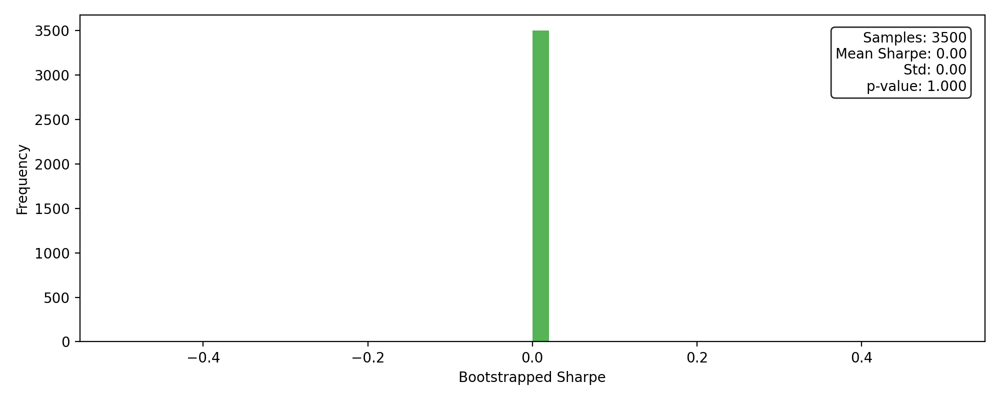
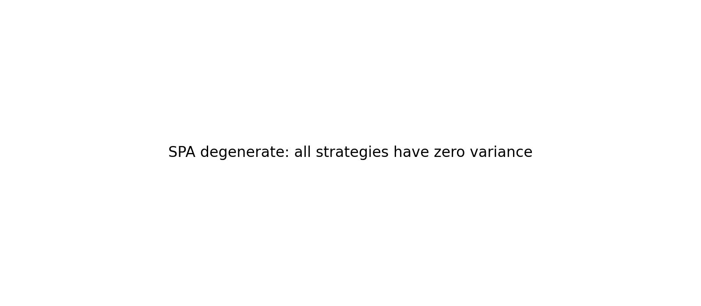

# WRDS Flagship Walk-Forward

## Headline Metrics

| Metric | Value |
| --- | ---:|
| Sharpe_HAC | 0.00 |
| MAR | 0.00 |
| MaxDD | 0.07% |
| Turnover | $434,237 |
| RealityCheck_p_value | 1.000 |
| SPA_p_value | n/a |

## Exposure Summary

| Metric | Value |
| --- | ---:|
| Avg net exposure | -0.06% |
| Avg gross exposure | 0.11% |
| Max net exposure | 0.70% |
| Max gross exposure | 1.54% |

_Exposure time series is recorded in equity_curve.csv._

## Cost Breakdown

| Category | Total |
| --- | ---:|
| Commission | $4 |
| Slippage | $0 |
| Borrow | n/a |
| Total | $4 |

## Visuals

## Hansen SPA Summary

SPA degenerate: all strategies have zero variance

## Factor Attribution (FF5+MOM)

| Factor | Beta | t-stat |
| --- | ---:| ---:|
| Alpha | -0.0000 | -7.10 |
| Mkt_RF | 0.0002 | 0.50 |
| SMB | 0.0000 | 0.08 |
| HML | 0.0010 | 1.55 |
| RMW | 0.0009 | 1.26 |
| CMA | -0.0019 | -2.01 |
| MOM | -0.0003 | -0.76 |
